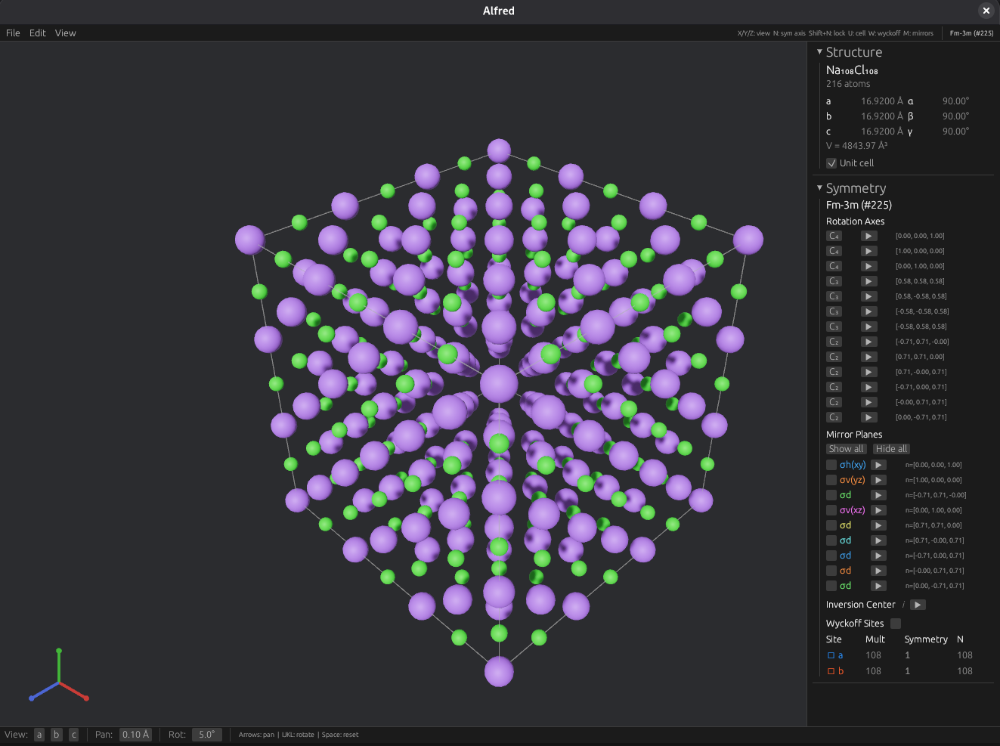
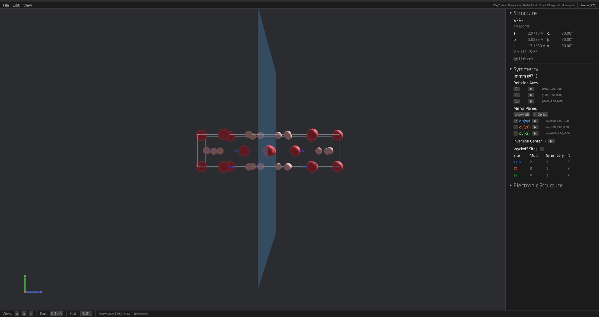

# Alfred

<table>
  <tr>
    <td></td>
    <td></td>
  </tr>
</table>

Alfred is a structure visualizer with a primary focus on crystallographic symmetry and electronic structure. It was a natural extension of my inability to communicate what I saw in my own head to my colleagues. Planes of symmetry, rotational axes, wallpaper projections, etc. were so neatly organized in my head but were very challenging to articulate. Furthermore, if I were to even attempt a sketch I'd make the situation even worse. Thus, I started making alfred. I've included as many symmetry visualizations possible to aid in other's learning or intuition for crystallography. Furthermore, I've baked in a good deal of on-site properties and volumetric data visualizations to aid in analyzing the electronic structure of your ab initio calculations.

This program is named after my childhood dog, Alfred. He knew nothing of crystallography but he did know how to take it easy. Hopefully this tool can make your life a little easier.

## Development Prerequisites

If you haven't looked at the size of the binary, then you will be shocked to see how large it is. This is because it contains the standard library of Rust as well as its dependencies. This is because it is cross platform and must carry its own libraries wherever it goes. If you would like to _develop_ or tweak alfred, then you might have to install some development packages. I did not include instructions for Windows since I believe it is inhumane to make people develop on Windows. If you must do so, use WSL which is really just a Debian based operating system.

### System dependencies (Debian/Ubuntu)

```bash
sudo apt install -y cmake libclang-dev libasound2-dev libudev-dev libwayland-dev libxkbcommon-dev pkg-config
```

- `cmake` + `libclang-dev` — required by spglib (symmetry library, built from source via cargo)
- `libasound2-dev` + `libudev-dev` — required by Bevy (rendering engine)
- `libwayland-dev` + `libxkbcommon-dev` — Wayland display support

### macOS

```bash
brew install cmake llvm
```
Bevy dependencies are handled automatically on macOS.

## Building

```bash
# Development build (fast iteration)
cargo build

# Release build (optimized, stripped, ~50% smaller)
cargo build --release

# Run tests
cargo test

# Run a single test
cargo test test_parse_nacl
```

## Usage

```bash
# Open a POSCAR file
cargo run -- POSCAR

# Open a vasprun.xml (with DOS, forces, trajectory)
cargo run -- vasprun.xml

# Open a volumetric data file (CHGCAR, wavefunction, etc.)
cargo run -- density.vasp

# Combine: structure + vasprun + volumetric
cargo run -- POSCAR vasprun.xml CHGCAR

# Release mode (faster rendering for large systems)
cargo run --release -- POSCAR
```

Files can also be opened at runtime via **File > Open...** dialogs.

## Keyboard shortcuts

| Key | Action |
|-----|--------|
| **Left drag** | Orbit camera |
| **Right drag** | Pan camera |
| **Scroll** | Zoom |
| **Arrow keys** | Pan (scene moves in arrow direction) |
| **I / J / K / L** | Fine rotation (pitch / yaw) |
| **X / Y / Z** | Snap to axis-aligned view |
| **Space** | Reset to default view |
| **N** | Cycle symmetry axes |
| **Shift+N** | Lock/unlock rotation to symmetry axis |
| **U** | Toggle unit cell outline |
| **P** | Toggle periodic boundary images |
| **W** | Toggle Wyckoff position highlights |
| **M** | Toggle all mirror planes |
| **F12** | Save screenshot |

## Architecture

```
src/
├── main.rs          # App builder and system registration
├── camera.rs        # Camera controls (orbit, pan, IJKL, axis snap)
├── scene.rs         # Scene lifecycle (loading, toggling, trajectory, screenshots)
├── data/            # Canonical data models (Structure, VolumeGrid, ElementData)
├── io/              # File parsers (POSCAR, vasprun.xml, volumetric)
├── analysis/        # Symmetry detection, marching cubes, magnetic moments
├── vis/             # Rendering (atoms, arrows, isosurface, symmetry animation, etc.)
└── ui/              # egui panels (info panel, menu bar, vasprun controls)
```

Layers depend downward only: IO → Data → Analysis → Visualization → Application.

## License

MIT
